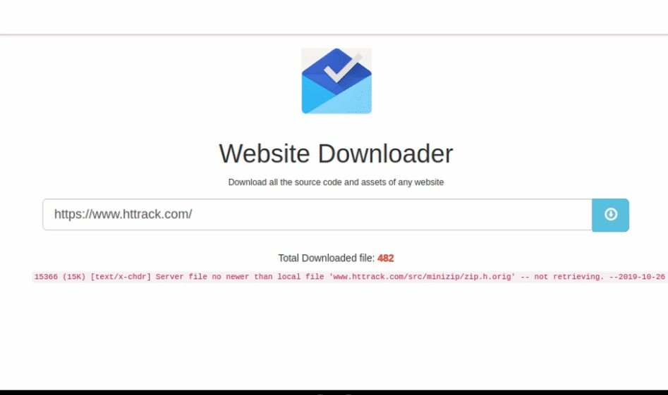

## Website Downloader

<p align="center">
  <a href="https://github.com/efeurhobobullish/website-downloader">
    
  </a>
</p>

<p align="center">
  <a href="https://github.com/efeurhobobullish/website-downloader">
    HERE'S AN EXAMPLE OUTPUT
  </a>
</p>

<p align="center">
<a href="https://github.com/efeurhobobullish/followers"></a>
<a href="https://github.com/efeurhobobullish/website-downloader/stargazers/"></a>
<a href="https://github.com/efeurhobobullish/website-downloader/network/members"></a>
<a href="https://github.com/efeurhobobullish/website-downloader/"></a>
<a href="https://github.com/efeurhobobullish/website-downloader/graphs/commit-activity"></a>
</p>

---

Download the complete source code and all assets of any website into a `.zip` file — directly from your browser. Powered by `wget` with full mirror, link conversion, and offline viewing support.

## Getting Started

<p align="center">
<a href="https://github.com/efeurhobobullish/website-downloader/fork">

</a>
</p>

1. **Clone the repository**
   ```bash
   git clone https://github.com/efeurhobobullish/website-downloader.git
   cd website-downloader
   ```

2. **Install dependencies**
   ```bash
   npm install
   ```

3. **Start the server**
   ```bash
   npm start
   ```

4. **Open in your browser**
   ```
   http://localhost:3000
   ```

5. **Download a website**
   - Paste any URL (e.g. `https://www.example.com`) into the input field
   - Click the download button and watch the progress in real time
   - Once complete, click **Download Website Assets** to save the `.zip`

---

## Deployment

<p align="center">
<a href="https://dashboard.heroku.com/new?template=https://github.com/efeurhobobullish/website-downloader" target="_blank">
  
</a>
&nbsp;
<a href="https://dashboard.render.com" target="_blank">
  
</a>
&nbsp;
<a href="https://app.koyeb.com" target="_blank">
  
</a>
</p>

Or run with Docker:
```bash
docker build -t website-downloader .
docker run -p 3000:3000 website-downloader
```

---

### Owner

<a href="https://github.com/efeurhobobullish">
  
</a>

**efeurhobobullish** — [GitHub](https://github.com/efeurhobobullish)

---

### Enjoy 🚀

Thank you for using Website Downloader. Star ⭐ the repo if it helped you!
